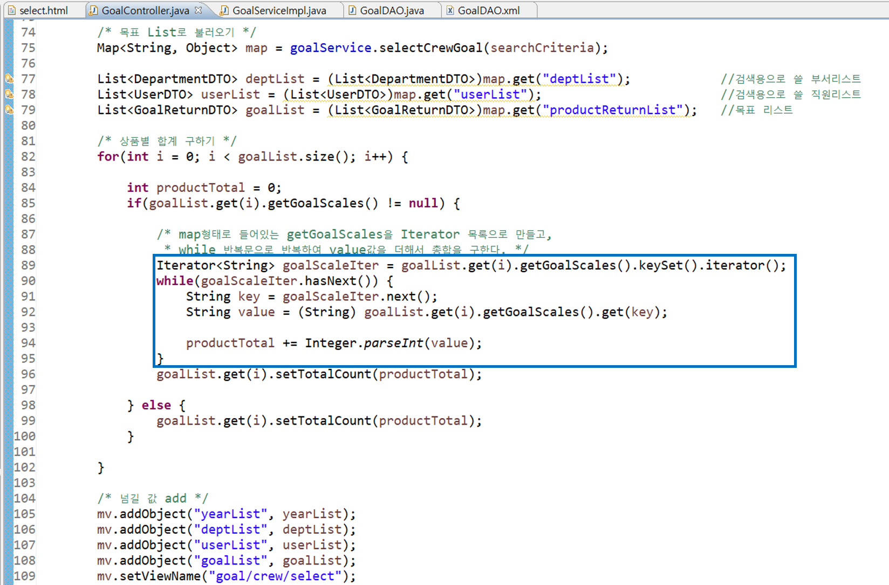

# 구현과정과 소감

## 프로그램 설명

.png>)

크게 두가지로 나눈다면 영업프로세스와 분석 및 사내프로세스관리의 2개의 프로세로 나눌 수 있습니다.

세부 메뉴를 살펴보면 영업사원이 영업과 고객전반을 관리할 수 있는 **영업메뉴**, 영업과 관련된 통계를 검색해서 표 및 차트형식으로 볼 수 있는 **통계메뉴**, 칸반보드형태로 검색하고 관리할 수 있는 **보드메뉴**, 관리자 권한이 있는 사용자만 들어가서 관리할 수 있는 **관리자메뉴**, 마지막으로 내 정보와 회사 정보를 조회할 수 있는 **마이페이지**로 이루어져있습니다.

#### 1. 영업

* 영업활동, 영업기회 관리
* 고객사, 고객 관리
* 영업관리(잠재고객 - 제안 - 견적 - 계약 - 매출 - 고객지원)
* 영업도구(영업보고, 영업공지, 회의록)
* 상담, 상품, 수금관리
* 전자결재
* 목표관리(개인목표, 팀목표)

#### 2. 통계

* 종합현황
* 고객현황
* 영업현황
* 실적현황

#### 3. 보드

* 고객사 조회
* 고객 조회
* 영업기회 조회

#### 4. 관리자

* 메뉴그룹관리
* 조직관리
* 사용자관리
* 회사정보관리

#### 5. 마이페이지

* 내 정보 조회
* 회사정보 조회

## 구현화면 및 코드설명&#x20;

#### 1. 개인목표수정&#x20;

: 사용자는 각 연도별, 상품별로 목표를 수정할 수 있습니다.

1\) 화면설명

.png>)

.png>)

* 개인목표 화면에서 '수정하기'버튼을 누르면 수정 Modal이 뜹니다.
* 제품명, 제품번호, 목표량, 목표번호를 받아서 Modal창에서 출력합니다.
* 원하는 목표량을 입력하고 update버튼을 클릭하면, 각 목표번호의 목표량이 수정됩니다.

2\) Controller

.png>)

* selectCrewGoal 메소드에 검색조건(searchCriteria)을 보내서 목표 List를 불러온다.
* 상품별로 합계를 구해야 하므로, 받아온 GoalReturnDTO의 속성 중 Map형태로 된 월별목표량을 getGoalScales()메소드로 가져오고 iterator 목록으로 바꾼다.
* iterator의 요소가 남아있을 때까지 while문을 돌려서 합계를 구한다.

3\) Service

.png>)

* productReturnList는 상품별목록으로 GoalReturnDTO로 구성되어 있고, goalScales는 아직 비어 있는 상태입니다.
* goalList의 size()의 길이만큼 반복문을 돌립니다. 해당 GoalDTO의 month를 검색하여 goalScales에 넣어줍니다.

#### 2. 팀목표조회&#x20;

## 소감

마지막 프로젝트를 수행하며 느낀 것은 '**코딩컨벤션**'의 중요함 입니다.

프로젝트 초반에는 서로의 코드를 리뷰할 시간도 있었지만, 점점 각자의 기능에 집중하기에 다른 조원의 코드를 따라가기 어려웠습니다. 속도에만 집중했기에, 심지어 제가 작성한 코드도 이게 무슨 뜻인지 이해하는데 시간이 걸렸습니다. 그래서 코딩컨벤션에 맞추어 코드를 작성하고자 했습니다. 복잡한 부분에 대해서는 상세주석을 달아 다른 조원들의 이해를 도왔습니다. 변수명을 설정할 때에도 이것이 의미하는 바가 무엇인지 알아볼 수 있도록 짓기 위해 노력했습니다. 이를 통해 서로 피드백을 해주기가 좀 더 용이해졌습니다.

두번째는 '**의사소통**'입니다.

제가 이번에 맡은 역할은 공통코드 였습니다. 처음 틀을 잡고 모든 기능의 패키지와 템플릿 페이지를 만들어야 했습니다. 어려웠던 것은 제가 구현하지 않는 기능에 대해서는 구체적인 것까지 모른다는 것이었습니다. 그래서 의문이 있는 점에 대해서는 적극적으로 질문하였고, 피드백에 대해서는 바로 반영했습니다. 덕분에 만들어진 공통코드 위에서 조원들이 구현을 시작할 수 있었습니다. 이후 각자 기능 구현 시에도 서로의 문제상황을 공유하고 피드백을 해주면서 보다 빠르게 해결할 수 있었습니다. 혼자 1시간넘게 붙들고 있는 문제를, 조원들에게 공유하자 손쉽게 해결하는 경험을 하기도 했습니다.

실무에도 위 두가지의 중요성을 인지하여, 팀원들끼리 쉽게 이해할 수 있고 효율성을 증대할 수 있는 코드를 작성하도록 노력하겠습니다.
