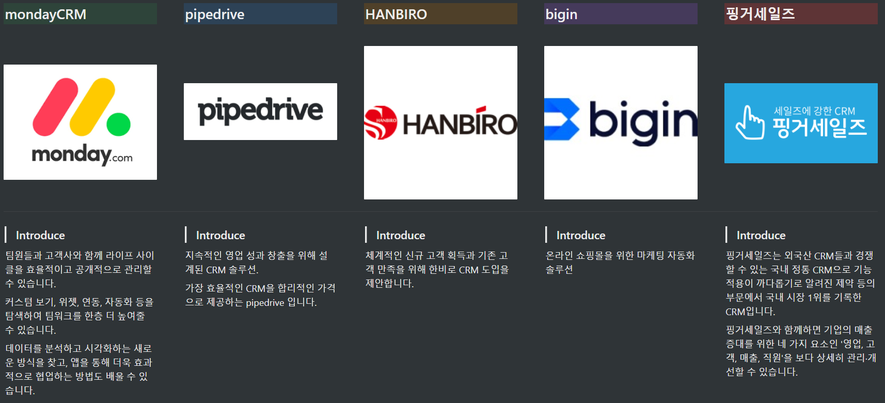

# 효과적인 영업관리 프로그램

## 기획

* 프로젝트 수행기간 : 2021.09.23 \~ 2021.10.25
* 참여 인원 : 5명
* 프로젝트 산출물 : Notion페이지
* 소스코드 : [https://gitlab.com/codefactory-mnm/codefactory-mnm-project](https://gitlab.com/codefactory-mnm/codefactory-mnm-project)
* 프로젝트 목표 : CRM을 이용함에 있어서, 각 영업 건을 단계별로 관리할 수 있고, 다양한 통계분석으로 영업담당자들의 실적을 한눈에 볼 수 있도록 하는 프로그램입니다.&#x20;
* 개발환경 :  (1).png>)

## 프로젝트 방향성

그룹웨어 중에서도, CRM에 집중하여 영업과 고관리를 함께 할 수 있는 프로그램을 만들고자 했습니다.&#x20;

1. 보다 더 <mark style="color:orange;">효율적인 고객관리</mark>로 매출상승에 긍정적인 효과를 높인다.
2. 신규고객 발굴부터 수금확인까지 CRM의 <mark style="color:orange;">All-in-One</mark> 솔루션 제공할 수 있도록 한다.
3. 관리하기 어려운 영업관리 KPI도 다양한 <mark style="color:orange;">통계</mark>기능으로 모니터링 가능하게 한다.
4. 자료의 지속성으로, <mark style="color:orange;">거래관리의 연속성</mark>을 보장하도록 한다.
5. <mark style="color:orange;">일관된 고객소통</mark>을 가능케하여, 커뮤니케이션 누락없이 고객경험을 상승시킨다.

## 유사프로그램 분석과 시장조사

본격적으로 구현하기에 앞서, 기존 프로그램을 분석하여 필요한 기능이 무엇인지 찾고, 시장에서 원하는 니즈가 무엇인지 조사하였습니다.

#### 유사프로그램 분

분석한 유사프로그램은 mondayCRM, pipedrive, HANBIRO, bigin, 핑거세일즈였으, 전반적으로 단계별 영업관리와 고객관리가 주요기능임을 파악하였습니다.

.png>)

 (1).png>)

#### 시장조사

시장조사를 통해 기본적으로 CRM의 개념과 영업관리 KPI의 중요성에 대해 찾아보았습니다. CRM 이란 Customer Relation Management의 약자로 <mark style="color:orange;">고객 관계 관리</mark>를 의미하며. 내 고객을 만들고 이를 장기간 유지하고자 할 때 필요한 경영전략입니다. KPI란 '<mark style="color:orange;">핵심성과지표</mark>'(Key Performance Indicator)로, 앞으로 있을 성과에 영향을 미치는 여러 핵심적인 지표들을 취합한 평가의 기준이며, 영업업무에 적용되는 KPI들도 검색하여 기능구현시 필요한 것들에 어떤 것이 있는지 조사하였습니다.&#x20;

또한 CRM 시장의 동향도 검색하여, 이슈관리를 위해 CRM 시장이 점차 발전하고 있음을 알 수 있었습니다.&#x20;

 (1).png>)

 (1).png>)

## WBS

WBS를 통해 일정관리를 하였으며, 이슈가 있는 경우 회의를 통해 이슈를 파악하고 정리하였습니다.

 (1) (1).png>)

아래와 같이 이슈사항이 발생할 경우, Notion에 기록하여 조원들이 공유할 수 있도록 하였습다.&#x20;

 (1).png>)

## 데이터베이스 설계

#### 1. 논리 데이터베이스(ERD) 설계

ERD란 데이터베이스에 저장할 내용을 구조화된 데이터로 표시하는 기법입니다.&#x20;

* 사용 tool : DA# Modeler 5
* 표기법 : Barker 표기법
* 엔터티 : 57개&#x20;

(웹상의 이미지가 잘 안보일경우, 첨부한 png파일을 참조하여 주시기바랍니다.)





여기서는 예시로 '목표' 엔터티를 살펴보겠습니다.

 (1).png>)

* 목표 엔터티는 별개로 '목표번호'라는 식별자를 부여하여 관리하였습니다.&#x20;
* 연도별로 쉽게 구분하기위해 '년'과 '월' 속성을 따로 나눠서 저장하였습니다.&#x20;
* 예컨대 2021년도의 모든 목표를 검색하고 싶을 때, 목표일자가 통째로 202110 로 저장되어있는 경우 앞자리 4자리를 잘라내어 '2021'과 일치하는지 비교하는 과정을 한번 더 거쳐야 합니다. 그러나 이렇게 년과 월을 따로 저장할 경우, 년 속성 중 '2021'과 일치하는 목표열만 불러오면 되므로 보다 간편해집니다.
* 개인목표와 팀목표는 엔터티를 따로 만들기보다 '구분'을 서브타입으로 만들었습니다. 그리고 개인은 사용자 엔터티에서 '사용자번호'를 foreign key로, 팀목표는 부서엔터티에서 '부서번호'를 foreign key로 받아왔습니다.&#x20;

#### 2. 상관 모델링

* 상관모델링이란 각 단위프로세스별로 어떤 엔터티와 CRUD하는지 관계성을 표시한 표입니다.
* CRUD란 C: Create, R: Read, U : Update, D: Delete를 말합니다.

#### 3. 테이블 정의서

.png>)

* 테이블정의서에서는 보다 구체적으로 각 엔터티 별 속성을 정의한 표입니다.&#x20;
* PK, FK, UNIQUE, CHECK, NULLABLE의 제한조건에 대해서도 적어놓아 쉽게 확인이 가능합니다.&#x20;

## 기획 및 화면설계

운영정책, Information Architecture, 메뉴구조도, 화면정의서를 작성했습니다.&#x20;

 (1).png>)

## 프로그램 설계

프로그램설계과정에서는 각 기능프로세스별로 나누었던 기능마다, package, Controller, URL, 구현방식들을 정했습니다. 이후 본격적으로 구현과정에 들어갔습니다.&#x20;

.png>)
